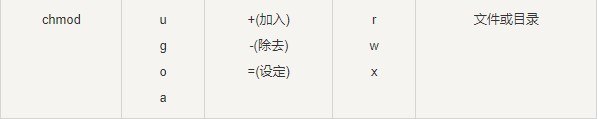
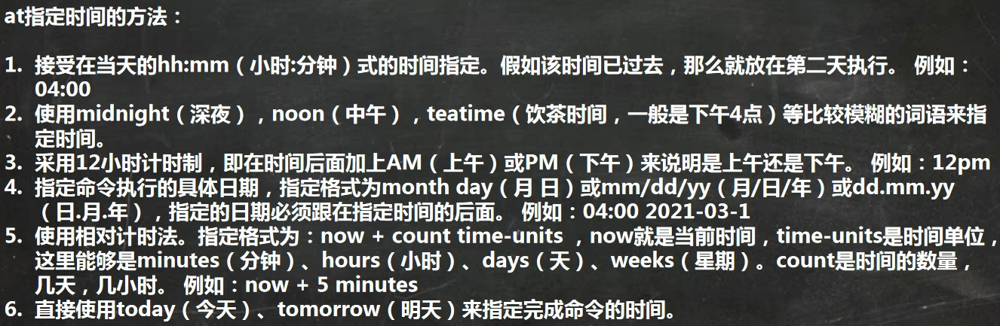

# 1.常用命令

## 1.1 指定运行级别（7个级别）

* 0.关机
* 1.单用户【找回丢失密码】
* 2.多用户状态没有网络服务
* 3.多用户状态有网络服务
* 4.系统未使用保留给用户
* 5.图形界面
* 6.系统重启

* 系统的运行级别配置文件：/etc/inittab

* 切换到指定运行级别的指令：init [012356]
* 查看当前运行级别：systemctl get-default
* 设置默认运行级别：systemctl set-default TARGET.target（TARGET可为multi-user.target或graphical.target）

## 1.2 帮助指令

### 1.2.1 man获得帮助信息

> man [命令或配置文件]

* 例如:man ls

### 1.2.2 help指令

> help [命令或配置文件]

## 1.3 文件目录类指令

### 1.3.1 文件剪贴删除复制重名等

* pwd：Print Working Directory，显示当前工作目录的绝对路径。
* ls：-a：显示当前目录所有的文件和目录，包括隐藏的（以.开头）；
  * -l：以列表的方式显示信息。
* cd：cd ~：回到自己的家目录；cd …：回到当前目录的上一级目录。
* mkdir：创建目录；-p：创建多级目录。
* rmdir：删除空目录。rmdir不能删除非空的目录。如果需要删除非空的目录，需要使用rm -rf。
* cp：拷贝文件到指定目录；
  * -r：递归复制整个文件夹。强制覆盖不提示的方法：
  * cp命令改为\cp
* rm：移除文件或目录；
  * -r：递归删除整个文件夹；
  * -f：强制删除不提示。
* mv：移动文件与目录或重命名，两种功能！
* touch：创建空文件。可以一次性创建多个文件
* ln 给文件创建一个软连接
  * 用法：ln -s [源文件或目录] 软连接名所在目录
  * 删除软连接：rm 软连接所在目录
  * 当我们使用pwd指令查看目录时，仍然看到的是软链接所在目录

### 1.3.2 文件查看

* cat：查看文件内容。只能浏览文件，而不能修改文件。
  * -n：显示行号。
  * 结尾加上 | more：分页显示，不会全部一下显示完。
  
* more：是一个基于Vi编辑器的文本过滤器，它以全屏幕的方式按页显示文本文件的内容。more还内置了很多快捷键

  

* less：用来分屏查看文件内容，与more相似，但是更强大，支持各种显示终端。less指令在显示文件内容时，并不是一次将整个文件加载之后才显示，而是根据显示需要加载内容。对于显示大型文件具有较高的效率。

* head：显示文件的开头部分。-n 5：看前面5行内容。

* tail：输出文件中尾部的内容。
  * -n 5：看后面5行内容。
  * -f：时事追踪该文档的所有更新

* \>指令：输出重定向。如果不存在会创建文件，否则会将原来的文件内容覆盖。

* \>>指令：追加。如果不存在会创建文件，否则不会覆盖原来的文件内容，而是追加到文件的尾部。

* echo：输出内容到控制台。

* history：查看历史指令
  * 显示最近使用过的n个指令：history n
  * 执行历史编号为n的指令：!n

### 1.3.3 时间和日期

* date：显示当前日期和时间
  * date +%Y：显示当前年份
  * date +%m：显示当前月份
  * date "+%Y-%m-%d %H:%M:%S"：显示年-月-日 时:分:秒
  * 设置系统当前时间：date -s "2023-12-07 21:12:07"
* cal：查看当前月份
  * cal [月] [年份]：显示某一年或月的日历

### 1.3.4 搜索查找类

* find：从指定目录向下递归的遍历其各个子目录，将满足条件的文件或者目录显示在终端。

  

  * 查询 /目录下所有.txt的文件：find / -name *.txt

* locate：locate (搜索文件)
  * 可以快速定位文件路径。locate指令利用事先建立的系统中所有文件名称及路径的locate数据库实现快速定位给定的文件。
  * locate指令无需遍历整个文件系统，查询速度较快。为了保证查询结果的准确度，管理员必须定期更新locate时刻。
  * 在第一次运行之前，必须使用updatedb指令创建locate数据库。

* which指令，可以查看某个指令在哪个目录下，比如Is指令在哪个目录：which Is

* grep：过滤查找，表示将前一个命令的处理结果输出传递给后面的命令处理。经常跟管道一起使用。
  * grep [选项] 查找内容 源文件
  * -n：显示匹配行及行号。
  * -i：忽略大小写字母。
  * cat hello.txt | grep yes

### 1.3.5 压缩和解压

* gzip/gunzip：压缩文件/解压
  * gzip 文件：压缩为.gz文件，原来文件不保留。
  * gunzip 文件：解压缩，同样也不保留源文件。
  
* zip/unzip：压缩文件/解压
  * zip [选项] 压缩后文件xxx.zip 将要压缩的文件
  * unzip [选项] 要解压的文件xxx.zip
  * zip -r：递归压缩，即压缩目录
  * unzip -d (目录)：指定解压后的文件的存放目录
  
* tar：打包指令，最后打包后的文件是.tar.gz的文件
  
  
  
  * 压缩：tar -cvf 压缩后文件名 要压缩的文件
  * 解压：tar -xvf 要解压的文件
  * 解压到指定目录：tar -xvf (要解压的文件) -C (指定目录)，指定解压到的目录要存在

## 1.4 更多命令

[Linux命令大全](https://www.runoob.com/linux/linux-command-manual.html)

# 2.组管理和权限管理

## 1. Linux组基本介绍

Linux中每个用户属于一个组，不能独立于组以外。所以在Linux中每个文件存在组的概念

## 2. 文件/目录所有者

> 一般为文件的创建者，谁创建了该文件，就自然的称为该文件的所有者。

* 查看文件所有者：ls -ahl
* 修改文件所有者：chown 用户名 文件名

## 3. 文件/目录所在组

> 当某个用户创建了一个文件之后，默认文件所在组就是该用户所在的组

* 查看文件所有者：ls -ahl
* 修改文件所在组：chgrp 组名 文件名

## 4. 其他组

> 除文件的所有者和所在组的用户外，系统的其他用户都是文件的其他组

改变用户所在组

+ usermod -g 新组名 用户名
+ 改变该用户登陆的初始目录（用户要有进入该目录的权限）：usermod -d 目录名 用户名

## 5. 文件属性

* ls -l中显示的内容如图所示
  

1. 在Linux中第一个字符
   * 当为[ d ]则是目录
   * 当为[ - ]则是文件；
   * 若是[ l ]则表示为链接文档(link file)；
   * 若是[ b ]则表示为装置文件里面的可供储存的接口设备(可随机存取装置)；
   * 若是[ c ]则表示为装置文件里面的串行端口设备，例如键盘、鼠标(一次性读取装置)。
2. 每个文件的属性由左边第一部分的10个字符来确定
    

### 5.1 rwx权限详解

* rwx作用到文件：
  * r：read，可读。读取查看。
  * w：write，可以修改。但不代表可以删除该文件。删除一个文件的前提条件是对该文件所在的目录有写权限，才能删除该文件。
  * x：execute，可执行。可以被执行。
* rwx作用到目录：
  * r：可以读取，ls查看目录内容。
  * w：可以修改，目录内创建+删除+重命名目录。
  * x：可执行，可以进入该目录。

### 5.2 修改权限

#### 5.2.1 chgrp：更改文件属组

* chgrp [-R] 属组名 文件名
  * -R：递归更改文件属组，就是在更改某个目录文件的属组时，如果加上-R的参数，那么该目录下的所有文件的属组都会更改。

#### 5.2.2 chown：更改文件属主，也可以同时更改文件属组

> 语法:
>
> * chown [–R] 属主名 文件名
> * chown [-R] 属主名:属组名 文件名
>   * -R：如果是目录则使其下所有子文件或目录递归生效

#### 5.2.3 chmod：更改文件9个属性

Linux文件的基本权限就有九个，分别是owner/group/others三种身份各有自己的read/write/execute权限。

##### 5.2.3.1 使用数字修改权限

* **chmod [-R] xyz 文件或目录**
  * xyz : 数字类型的权限属性
  * -R : 进行递归(recursive)的持续变更，亦即连同次目录下的所有文件都会变更

##### 5.2.3.1 使用符号修改权限

* 我们就可以使用 u(user), g(group), o(others) 来代表三种身份的权限！
* 此外， a 则代表 all，即全部的身份。读写的权限可以写成 r, w, x，也就是可以使用下表的方式来看
  
* 举例说明
  

# 3.定时任务调度

## 3.1 crond任务调度

> 

* 使用方法：crontab [选项]
  * -e：编辑crontab定时任务
  * -i：查询crontab任务
  * -r：删除当前用户所有的crontab任务
  * -l：列出当前有哪些任务调度
  * service crond restart：重启任务调度
  * 当保存退出后就生效了

| 项目      | 含义                 | 范围                    |
| --------- | -------------------- | ----------------------- |
| 第一个“*” | 一小时当中的第几分钟 | 0-59                    |
| 第二个“*” | 一天当中的第几小时   | 0-23                    |
| 第三个“*” | 一个月当中的第几天   | 1-31                    |
| 第四个“*” | 一年当中的第几月     | 1-12                    |
| 第五个“*” | 一周当中的星期几     | 0-7（0和7都代表星期日） |

* 特殊符号说明
  * `\*`代表任何时间
  * `,`代表不连续的时间。比如“0 8,12,16 \* * *命令”，就代表在每天的8点0分，12点0分，16点0分都执行一次命令
  * `-`代表连续的时间范围。比如“0 5 * * 1-6命令”，代表在周一到周六的凌晨5点0分执行命令
  * `/n`代表每隔多久执行一次。比如“*/10 \* * * * 命令”，代表每隔10分钟就执行一遍命令

## 3.2 at定时任务

1. at命令是一次性定时计划任务，at的守护进程atd会以后台模式运行，检查作业队列来运行

   

2. 默认情况下，atd守护进程每60秒检查作业队列，有作业时，会检查作业运行时间，如果时间与当前时间匹配，则运行此作业

3. 在使用at命令的时候，一定要保证atd进程的启动（可以使用ps-ef | grep atd查看）

  命令格式：at [选项]  [时间]

  Ctrl +D 结束at命令的输入，atq查看没有执行的任务，atrm 编号删除已经设置的任务

  

