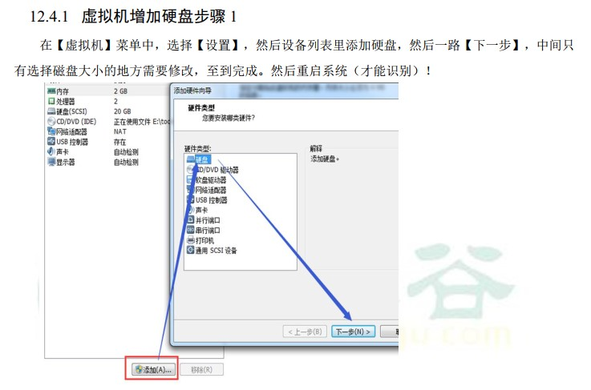

# 1.Linux磁盘分区、挂载度

## 1.1 分区方式

* mbr分区
  * 最多支持四个主分区
  * 系统只能安装在主分区
  * 扩展分区要占一个主分区
  * MBR最大只支持2TB，但拥有最好的兼容性
* gpt分区
  * 支持无限多个主分区（但操作系统可能限制，比如windows下最多128个分区）
  * 最大支持18EB的大容量（1EB=1024PB，PB=1024TB）
  * windows7 64位以后支持gpt

## 1.2 Linux分区

### 1.2.1 分区原理

* Linux无论有几个分区，分给哪一个目录使用，它归根结底就只有一个根目录，一个独立且唯一的文件结构，Linux中每个分区都是用来组成整个文件系统的一部分。
* Linux采用了一种叫做“载入”的处理方法，它的整个文件系统中包含了一整套的文件和目录，且将一个分区和一个目录联系起来。这时要载入的一个分区将使它的存储空间在一个目录下获得。


### 1.2.2 硬盘说明


* lsblk [-f]：查看当前系统的分区和挂载情况。（list block）

## 1.3 挂载硬盘

>需求是给我们的Linux系统增加一个新的硬盘，并且挂载到/home/newdisk

1. 添加硬盘
2. 分区：fdsk /dev/sdb
3. 格式化：mkfs -t ext4 /dev/sdb1
4. 挂载：新建目录：mkdir /home/newdisk；挂载：mount /dev/sdb1 /home/newdisk
5. 永久挂载：重启系统后，仍然可以挂载。vim /etc/fstab：增加挂载信息
6. mount -a：生效（可以省略）

#### 1.3.1 增加硬盘



#### 1.3.2 硬盘分区


#### 1.3.3 格式化磁盘


#### 1.3.4 挂载硬盘


#### 1.3.5 永久挂载


#### 1.3.6 取消挂载

umount /dev/sdb1或umount /home/newdisk

## 1.4 磁盘状况查询

* 磁盘情况查询：df -h / df -l

* 查询指定目录的磁盘占用情况：du -h /目录，默认为当前目录
  * -s：指定目录占用大小汇总
  * -h：带计量单位
  * -a：含文件
  * –max-depth=1：子目录深度
  * -c：列出明细的同时，增加汇总值


* 磁盘情况-工作实用指令
  * 统计/home文件夹下文件的个数：ls -l /home | grep "^-" | wc -l
  * 统计/home文件夹下目录的个数：ls -l /home | grep "^d" | wc -l
  * 统计/home文件夹下文件的个数，包括子文件夹里的：ls -lR /home | grep "^-" | wc -l
  * 统计文件夹下目录的个数，包括子文件夹里的：ls -lR /home | grep "^d" | wc -l
  * 以树状显示目录结构：首先安装tree指令：yum install tree，tree 目录

# 2.网络配置

## 2.1 Linux网络配置原理

> 虚拟机NAT网络配置原理


## 2.2 查看网络IP和网关

### 2.2.1 虚拟机网络编辑器


### 2.2.2 修改IP地址


### 2.2.3 查看网关


### 2.4 查看windows中虚拟网卡的ip地址

* 使用ipconfig查看ip配置并可以修改

  

## 2.4 Linux网络环境配置

### 4.1 自动抓取


**`缺点：`** 每次自动获取的ip地址可能不一样，不适用于做服务器

### 4.2 指定ip地址

1. 直接修改配置文件来指定IP，并可以连接到外网，编辑：vim /etc/sysconfig/network-scripts/ifcfg-ens33，修改以下配置

   ```
   BOOTPROTO=static
   #IP地址
   IPADDR=192.168.200.130
   #网关
   GATEWAY=192.168.200.2
   #域名解析器
   DNS1=192.168.200.2
   ```

2. 修改子网IP和网关IP


3. 重启网络服务或重启系统：service network restart/reboot

## 2.5 设置主机名和hosts映射

> Hosts是一个文本文件，用来记录IP和Hostname(主机名)的映射关系
>  DNS（域名系统）是互联网上作为域名和IP地址相互映射的一个分布式数据库

### 2.5.1 设置主机名

+ hostname：查看主机名
  + 修改文件在/etc/hostname指定修改后，重启生效

### 2.5.2 设置hosts映射

+ 如何通过主机名能够找到某个linux系统：windows
  在C:\Windows\System32\drivers\etc\hosts文件指定即可
+ linux在/etc/hosts文件指定

### 2.5.3 主机名解析机制

1. 浏览器先检查缓存中有没有该域名解析IP地址，有就先调用这个IP完成解析；如果没有检查DNS解析器缓存，如果有直接返回IP完成解析。这两个缓存，可以理解为本地解析器缓存
2. 一般来说，当电脑第一次成功访问某一网站后，在一定时间内，浏览器或操作系统会缓存他的IP地址（DNS解析记录)如在cmd窗口中输入
   + ipconfig /displaydns //DNS域名解析缓存
   + ipconfig /flushdns //手动清理dns缓存

3. 如果本地解析器缓存没有找到对应映射，检查系统中hosts文件中有没有配置对应的域名IP映射，如果有，则完成解析并返回
4. 如果本地DNS解析器缓存和hosts文件中均没有找到对应的IP，则到域名服务DNS进行解析
