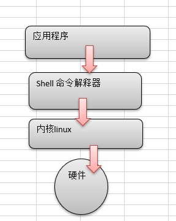
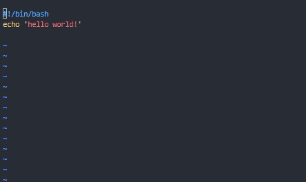
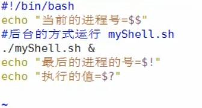
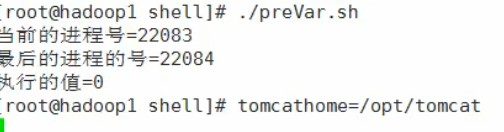

# Shell简介

## 1. Shell基础

* Shell 是一个用 C 语言编写的程序，它是用户使用 Linux 的桥梁。Shell 既是一种命令语言，又是一种程序设计语言。
* Shell 是指一种应用程序，这个应用程序提供了一个界面，用户通过这个界面访问操作系统内核的服务。
* Ken Thompson 的 sh 是第一种 Unix Shell，Windows Explorer 是一个典型的图形界面 Shell。

## 1.1 什么是shell

> Shell是一个命令行解释器，它为用户提供了一个向Linux内核发送请求以便裕兴程序的界面系统级程序，用户可以用Shell来启动、挂起、停止甚至是编写一些程序。



### 1.2 shell脚本

> Shell 脚本（shell script），是一种为 shell 编写的脚本程序。
> 业界所说的 shell 通常都是指 shell 脚本，但读者朋友要知道，shell 和 shell script 是两个不同的概念。

### 1.3 Shell 环境

>Shell 编程跟 JavaScript、php 编程一样，只要有一个能编写代码的文本编辑器和一个能解释执行的脚本解释器就可以了。

* Linux 的 Shell 种类众多，常见的有：
  * Bourne Shell（/usr/bin/sh或/bin/sh）
  * Bourne Again Shell（/bin/bash）
  * C Shell（/usr/bin/csh）
  * K Shell（/usr/bin/ksh）
  * Shell for Root（/sbin/sh）
* 本教程关注的是 Bash，也就是 Bourne Again Shell，由于易用和免费，Bash 在日常工作中被广泛使用。同时，Bash 也是大多数Linux 系统默认的 Shell。
* 在一般情况下，人们并不区分 Bourne Shell 和 Bourne Again Shell，所以，像 #!/bin/sh，它同样也可以改为 #!/bin/bash。

## 2. Shell脚本的运行

### 2.1 脚本的格式

* 脚本以#!/bin/bash 开头


### 2.2 脚本的执行

1. 赋予用户脚本执行权限
     * chmod +x ./test.sh  #使脚本具有执行权限
     * ./demo.sh
     * 注意，一定要写成 ./demo.sh，而不是 demo.sh，运行其它二进制的程序也一样，直接写 test.sh，linux 系统会去 PATH 里寻找有没有叫 demo.sh 的，而只有 /bin, /sbin, /usr/bin，/usr/sbin 等在 PATH 里，你的当前目录通常不在 PATH 里，所以写成 demo.sh 是会找不到命令的，要用 ./test.sh 告诉系统说，就在当前目录找。

2. 作为解释器参数
    * 这种运行方式是，直接运行解释器，其参数就是 shell 脚本的文件名，如：
        * /bin/sh test.sh
        * /bin/php test.php
        * sh demo.sh
    * 一般不这么用

# Shell变量

## 1. shell变量简介

* Linux Shell的变量分为，系统变量和用户自定义变量
* 系统变量：$HOME、$PWD、$SHELL、$USER等等
* 显示当前shell中所有变量：set

### 1.1 变量规则

* 变量名和等号之间不能有空格，这可能和你熟悉的所有编程语言都不一样。同时，变量名的命名须遵循如下规则：
* 命名只能使用英文字母，数字和下划线，首个字符不能以数字开头。
* 中间不能有空格，可以使用下划线（_）。
* 不能使用标点符号。
* 不能使用bash里的关键字（可用help命令查看保留关键字）。
* 变量名称一般习惯为大写

### 1.2 shell变量的定义

#### 1.2.1 基本语法

* 定义变量：变量=值，=两边不能有空格
* 撤销变量：unset 变量
* 声明静态变量：readonly 变量，注意：`不能unset`

#### 1.2.2 将命令的返回值赋给变量

* A=ls -la这里有反引号（ESC下面），运行里面的命令，并把结果返回给变量A
* A=$(ls -la)等价于上面

### 1.3 使用变量

* 使用一个定义过的变量，只要在变量名前面加美元符号即可，如：

```sh
your_name="qinjx"
echo $your_name
echo ${your_name}
```

* 量名外面的花括号是可选的，加不加都行，加花括号是为了帮助解释器识别变量的边界，比如下面这种情况：

```sh
for skill in Ada Coffe Action Java; do
    echo "I am good at ${skill}Script"
done
```

### 1.4 静态变量

* 使用 readonly 命令可以将变量定义为只读变量，只读变量的值不能被改变。
* 下面的例子尝试更改只读变量，结果报错：

```sh
#!/bin/bash
myUrl="http://www.google.com"
readonly myUrl
myUrl="http://www.runoob.com"
#######
# $/bin/sh: NAME: This variable is read only.
```

### 1.5 删除变量

* 使用 unset 命令可以删除变量。语法：unset variable_name
* 变量被删除后不能再次使用。unset 命令不能删除只读变量。

### 1.6 变量类型

1. `局部变量` 局部变量在脚本或命令中定义，仅在当前shell实例中有效，其他shell启动的程序不能访问局部变量。
2. `环境变量` 所有的程序，包括shell启动的程序，都能访问环境变量，有些程序需要环境变量来保证其正常运行。必要的时候shell脚本也可以定义环境变量。
3. `shell变量` shell变量是由shell程序设置的特殊变量。shell变量中有一部分是环境变量，有一部分是局部变量，这些变量保证了shell的正常运行

## 2. 环境变量

> 所有的程序，包括shell启动的程序，都能访问环境变量，有些程序需要环境变量来保证其正常运行。必要的时候shell脚本也可以定义环境变量。

* 基本语法
* export 变量名=变量值：将shell变量输出为环境变量
* source 配置文件：让修改后的配置文件信息立即生效
* echo $变量名：查询环境变量的值

## 3. Shell 注释

* 以 # 开头的行就是注释，会被解释器忽略。
* 通过每一行加一个 # 号设置多行注释，像这样：

```sh
#--------------------------------------------
# 这是一个注释
# author：菜鸟教程
# site：www.runoob.com
# slogan：学的不仅是技术，更是梦想！
#--------------------------------------------
##### 用户配置区 开始 #####
#
#
# 这里可以添加脚本描述信息
#
#
##### 用户配置区 结束  #####
```

> 多行注释

* 多行注释还可以使用以下格式：

```sh
:<<EOF
注释内容...
注释内容...
注释内容...
EOF
```

* EOF 也可以使用其他符号:

```sh
:<<'
注释内容...
注释内容...
注释内容...
'

:<<!
注释内容...
注释内容...
注释内容...
!
```

## 4. 位置参数,预定义变量

* 我们可以在执行 Shell 脚本时，向脚本传递参数，脚本内获取参数的格式为：$n。n 代表一个数字，1 为执行脚本的第一个参数，2 为执行脚本的第二个参数，以此类推……

```sh
#!/bin/bash

echo "Shell 传递参数实例！";
echo "执行的文件名：$0";
echo "第一个参数为：$1";
echo "第二个参数为：$2";
echo "第三个参数为：$3";

:<<!
chmod +x test.sh
$ ./test.sh 1 2 3
Shell 传递参数实例！
执行的文件名：./test.sh
第一个参数为：1
第二个参数为：2
第三个参数为：3
!
```

* 另外，还有几个特殊字符用来处理参数：

| 参数处理 | 说明                                                         |
| -------- | ------------------------------------------------------------ |
| \$\#     | 传递到脚本的参数个数                                         |
| \$\*     | 以一个单字符串显示所有向脚本传递的参数。如"\$*"用「"」括起来的情况、以"\$1 \$2 … \$n"的形式输出所有参数。 |
| \$$      | 脚本运行的当前进程ID号                                       |
| $!       | 后台运行的最后一个进程的ID号                                 |
| \$@      | 与\$*相同，但是使用时加引号，并在引号中返回每个参数。如"\$@"用「"」括起来的情况、以"$1" "$2" … "$n" 的形式输出所有参数。 |
| \$-      | 显示Shell使用的当前选项，与set命令功能相同。                 |
| \$?      | 显示最后命令的退出状态。0表示没有错误，其他任何值表明有错误。 |

```sh
#!/bin/bash
echo "Shell 传递参数实例！";
echo "第一个参数为：$1";
echo "参数个数为：$#";
echo "传递的参数作为一个字符串显示：$*";

:<<!
$chmod +x test.sh
$./test.sh 1 2 3
Shell 传递参数实例！
第一个参数为：1
参数个数为：3
传递的参数作为一个字符串显示：1 2 3
!
```

* 预定义变量实例
  
  

# Shell 字符串

>字符串是shell编程中最常用最有用的数据类型（除了数字和字符串，也没啥其它类型好用了），字符串可以用单引号，也可以用双引号，也可以不用引号。单双引号的区别跟PHP类似。

## 1. 单引号

```sh
str='this is a string'
```

* 单引号字符串的限制：
  * 单引号里的任何字符都会原样输出，单引号字符串中的变量是无效的；
  * 单引号字串中不能出现单独一个的单引号（对单引号使用转义符后也不行），但可成对出现，作为字符串拼接使用。

## 2. 双引号

```sh
your_name='runoob'
str="Hello, I know you are \"$your_name\"! \n"
echo -e $str

# 输出结果为：
# Hello, I know you are "runoob"!
```

* 双引号的优点：
  * 双引号里可以有变量
  * 双引号里可以出现转义字符

## 3. 拼接字符串

```sh
your_name="runoob"

# 使用双引号拼接
greeting="hello, "$your_name" !"
greeting_1="hello, ${your_name} !"
echo $greeting  $greeting_1
# 使用单引号拼接
greeting_2='hello, '$your_name' !'
greeting_3='hello, ${your_name} !'
echo $greeting_2  $greeting_3

#输出结果为：
#hello, runoob ! hello, runoob !
#hello, runoob ! hello, ${your_name} !
```

## 4. 获取字符串长度

```sh
string="abcd"
echo ${#string} #输出 4
```

## 5. 提取子字符串

以下实例从字符串第 2 个字符开始截取 4 个字符：

```sh
string="runoob is a great site"
echo ${string:1:4} # 输出 unoo
```

## 6. 查找子字符串

查找字符 i 或 o 的位置(哪个字母先出现就计算哪个)：

```sh
string="runoob is a great site"
echo `expr index "$string" io`  # 输出 4
注意： 以上脚本中 ` 是反引号，而不是单引号 '，不要看错了哦。
```

# Shell数组

* 数组中可以存放多个值。Bash Shell 只支持一维数组（不支持多维数组），初始化时不需要定义数组大小（与 PHP 类似）。

## 1. 数组赋值

* 与大部分编程语言类似，数组元素的下标由0开始。
* Shell 数组用括号来表示，元素用"空格"符号分割开，语法格式如下：
  * array_name=(value1 ... valuen)
* 我们也可以使用下标来定义数组:

```sh
array_name[0]=value0
array_name[1]=value1
array_name[2]=value2
```

## 2. 读取数组

* 读取数组元素值的一般格式是：${array_name[index]}

```sh
#!/bin/bash

my_array=(A B "C" D)

echo "第一个元素为: ${my_array[0]}"
echo "第二个元素为: ${my_array[1]}"
echo "第三个元素为: ${my_array[2]}"
echo "第四个元素为: ${my_array[3]}"

#第一个元素为: A
#第二个元素为: B
#第三个元素为: C
#第四个元素为: D
```

* 获取数组中的所有元素,使用@ 或 * 可以获取数组中的所有元素，例如：

```sh
#!/bin/bash

my_array[0]=A
my_array[1]=B
my_array[2]=C
my_array[3]=D

echo "数组的元素为: ${my_array[*]}"
echo "数组的元素为: ${my_array[@]}"
```

* 获取数组长度的方法与获取字符串长度的方法相同，例如：

```sh
#!/bin/bash

my_array[0]=A
my_array[1]=B
my_array[2]=C
my_array[3]=D

echo "数组元素个数为: ${#my_array[*]}"
echo "数组元素个数为: ${#my_array[@]}"
```
