# 1.Java 内存模型

JMM 即 Java Memory Model，它定义了主存（所有共享信息存储的位置）、工作内存（每个线程自己私有的信息存储的位置）抽象概念，底层对应着 CPU 寄存器、缓存、硬件内存、 CPU 指令优化等。 

**JMM的意义**

- 计算机硬件底层的内存结构过于复杂，JMM的意义在于避免程序员直接管理计算机底层内存，用一些关键字synchronized、volatile等可以方便的管理内存。

**JMM 体现在以下几个方面** 

- 原子性 - 保证指令不会受到线程上下文切换的影响 
- 可见性 - 保证指令不会受 cpu 缓存的影响 
- 有序性 - 保证指令不会受 cpu 指令并行优化的影响

# 2.可见性

## 2.1 退不出的循环

先来看一个现象，main 线程对 run 变量的修改对于 t 线程不可见，导致了 t 线程无法停止：

```java
static boolean run = true;
public static void main(String[] args) throws InterruptedException {
    Thread t = new Thread(()->{
        while(run){
            // ....
        }
    });
    t.start();
    sleep(1);
    run = false; // 线程t不会如预想的停下来
}
```

为什么呢？分析一下： 

1. 初始状态， t 线程刚开始从主内存读取了 run 的值到工作内存。

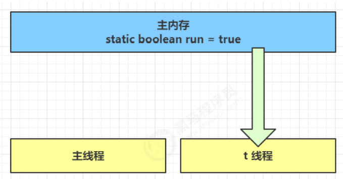

2. 因为 t 线程要频繁从主内存中读取 run 的值，JIT 编译器会将 run 的值缓存至自己工作内存中的高速缓存中， 减少对主存中 run 的访问，提高效率

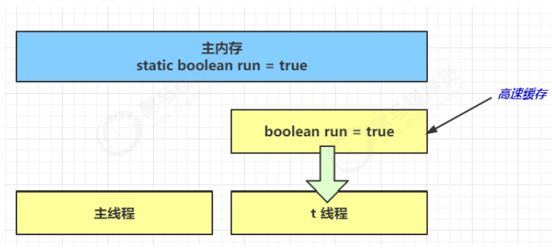

3. 1 秒之后，main 线程修改了 run 的值，并同步至主存，而 t 是从自己工作内存中的高速缓存中读取这个变量 的值，结果永远是旧值

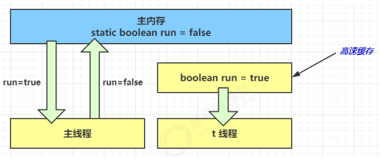


## 2.2 解决方法

volatile（易变关键字） 

它可以用来修饰成员变量和静态成员变量，他可以避免线程从自己的工作缓存中查找变量的值，必须到主存中获取 它的值，线程操作 volatile 变量都是直接操作主存

## 2.3 可见性 vs 原子性

前面例子体现的实际就是可见性，它保证的是在多个线程之间，一个线程对 volatile 变量的修改对另一个线程可 见， 不能保证原子性，仅用在一个写线程，多个读线程的情况： 上例从字节码理解是这样的：

```sh
getstatic run // 线程 t 获取 run true 
getstatic run // 线程 t 获取 run true 
getstatic run // 线程 t 获取 run true 
getstatic run // 线程 t 获取 run true 
putstatic run // 线程 main 修改 run 为 false， 仅此一次
getstatic run // 线程 t 获取 run false 
```

比较一下之前我们将线程安全时举的例子：两个线程一个 i++ 一个 i-- ，只能保证看到最新值，不能解决指令交错

```sh
// 假设i的初始值为0 
getstatic i // 线程2-获取静态变量i的值 线程内i=0 
getstatic i // 线程1-获取静态变量i的值 线程内i=0 
iconst_1 // 线程1-准备常量1 
iadd // 线程1-自增 线程内i=1 
putstatic i // 线程1-将修改后的值存入静态变量i 静态变量i=1 
iconst_1 // 线程2-准备常量1 
isub // 线程2-自减 线程内i=-1 
putstatic i // 线程2-将修改后的值存入静态变量i 静态变量i=-1 
```

**注意** 

synchronized 语句块既可以保证代码块的原子性，也同时保证代码块内变量的可见性。但缺点是 synchronized 是属于重量级操作，性能相对更低 。

> JMM关于synchronized的两条规定：

1. 线程解锁前，必须把共享变量的最新值刷新到主内存中
2. 线程加锁时，将清空工作内存中共享变量的值，从而使用共享变量时需要从主内存中重新获取最新的值

**加锁与解锁需要是同一把锁**

通过以上两点，可以看到synchronized能够实现可见性。同时，由于synchronized具有同步锁，所以它也具有原子性

如果在前面示例的死循环中加入 System.out.println() 会发现即使不加 volatile 修饰符，线程 t 也能正确看到 对 run 变量的修改了，想一想为什么？(println方法中有synchronized代码块保证了可见性)

synchronized关键字不能阻止指令重排，但在一定程度上能保证有序性（如果共享变量没有逃逸出同步代码块的话）。因为在单线程的情况下指令重排不影响结果，相当于保障了有序性。

## 2.4 两阶段终止模式

Two Phase Termination 

在一个线程 T1 中如何“优雅”终止线程 T2？这里的【优雅】指的是给 T2 一个料理后事的机会。

### 2.4.1 错误思路

- 使用线程对象的 stop() 方法停止线程 
  - stop 方法会真正杀死线程，如果这时线程锁住了共享资源，那么当它被杀死后就再也没有机会释放锁， 其它线程将永远无法获取锁 
- 使用 System.exit(int) 方法停止线程 
  - 目的仅是停止一个线程，但这种做法会让整个程序都停止

### 2.4.2 两阶段终止模式

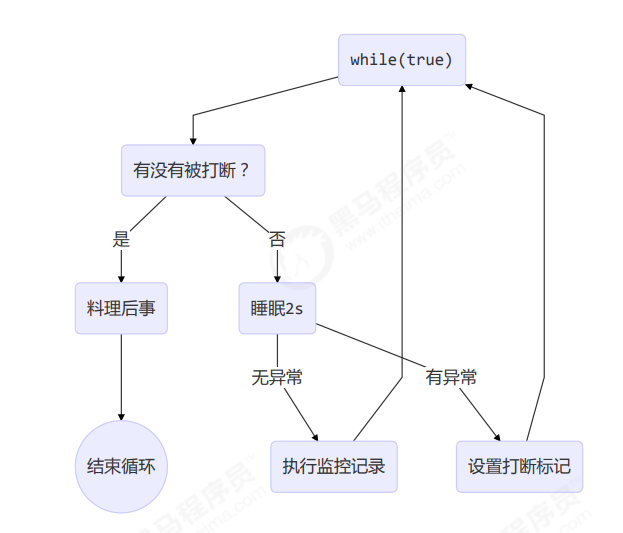

**利用 isInterrupted**

interrupt 可以打断正在执行的线程，无论这个线程是在 sleep，wait，还是正常运行

```java
class TPTInterrupt {
    private Thread thread;
    public void start(){
        thread = new Thread(() -> {
            while(true) {
                Thread current = Thread.currentThread();
                if(current.isInterrupted()) {
                    log.debug("料理后事");
                    break;
                }
                try {
                    Thread.sleep(1000);
                    log.debug("将结果保存");
                } catch (InterruptedException e) {
                    //打断sleep线程会清除打断标记，所以要添加标记
                    current.interrupt();
                }
                // 执行监控操作 
            }
        },"监控线程");
        thread.start();
    }
    public void stop() {
        thread.interrupt();
    }
}
```

调用

```java
TPTInterrupt t = new TPTInterrupt();
t.start();
Thread.sleep(3500);
log.debug("stop");
t.stop();
```

> 利用volatile修饰的停止标记

```java
// 停止标记用 volatile 是为了保证该变量在多个线程之间的可见性
// 我们的例子中，即主线程把它修改为 true 对 t1 线程可见
class TPTVolatile {
    private Thread thread;
    private volatile boolean stop = false;
    public void start(){
        thread = new Thread(() -> {
            while(true) {
                Thread current = Thread.currentThread();
                if(stop) {
                    log.debug("料理后事");
                    break;
                }
                try {
                    Thread.sleep(1000);
                    log.debug("将结果保存");
                } catch (InterruptedException e) {
                     }
                // 执行监控操作
            }
        },"监控线程");
        thread.start();
    }
    public void stop() {
        stop = true;
        //让线程立即停止而不是等待sleep结束
        thread.interrupt();
    }
}
```

调用

```java
TPTVolatile t = new TPTVolatile();
t.start();
Thread.sleep(3500);
log.debug("stop");
t.stop();
```

## 2.5 Balking模式

### 2.5.1 定义

Balking （犹豫）模式用在一个线程发现另一个线程或本线程已经做了某一件相同的事，那么本线程就无需再做 了，直接结束返回

### 2.5.2 实现

```java
public class MonitorService {
    // 用来表示是否已经有线程已经在执行启动了
    private volatile boolean starting;
    public void start() {
        log.info("尝试启动监控线程...");
        synchronized (this) {
            if (starting) {
                return;
            }
            starting = true;
        }
		//其实synchronized外面还可以再套一层if，或者改为if(!starting)，if框后直接return
        // 真正启动监控线程...
    }
}
```

当前端页面多次点击按钮调用 start 时 

它还经常用来实现线程安全的单例

```java
public final class Singleton {
    
    private Singleton() {
    }
    
    private static Singleton INSTANCE = null;
    
    public static synchronized Singleton getInstance() {
        if (INSTANCE != null) {
            return INSTANCE;
        }
        INSTANCE = new Singleton();
        return INSTANCE;
    }
}
```

对比一下保护性暂停模式：保护性暂停模式用在一个线程等待另一个线程的执行结果，当条件不满足时线程等待。

# 3.有序性

JVM 会在不影响正确性的前提下，可以调整语句的执行顺序，思考下面一段代码

```java
static int i;
static int j;
// 在某个线程内执行如下赋值操作
i = ...; 
j = ...; 
```

可以看到，至于是先执行 i 还是 先执行 j ，对最终的结果不会产生影响。所以，上面代码真正执行时，既可以是

```java
i = ...; 
j = ...;
```

也可以是

```java
j = ...;
i = ...; 
```

这种特性称之为『指令重排』，多线程下『指令重排』会影响正确性。为什么要有重排指令这项优化呢？从 CPU 执行指令的原理来理解一下吧

## 3.1 指令级并行原理

**Clock Cycle Time** 

主频的概念大家接触的比较多，而 CPU 的 Clock Cycle Time（时钟周期时间），等于主频的倒数，意思是 CPU 能 够识别的最小时间单位，比如说 4G 主频的 CPU 的 Clock Cycle Time 就是 0.25 ns，作为对比，我们墙上挂钟的 Cycle Time 是 1s 

例如，运行一条加法指令一般需要一个时钟周期时间 

**CPI**

有的指令需要更多的时钟周期时间，所以引出了 CPI （Cycles Per Instruction）指令平均时钟周期数 

**IPC** 

IPC（Instruction Per Clock Cycle） 即 CPI 的倒数，表示每个时钟周期能够运行的指令数 

**CPU 执行时间** 

程序的 CPU 执行时间，即我们前面提到的 user + system 时间，可以用下面的公式来表示

```java
程序 CPU 执行时间 = 指令数 * CPI * Clock Cycle Time
```

### 3.1.1 指令重排序优化

事实上，现代处理器会设计为一个时钟周期完成一条执行时间最长的 CPU 指令。为什么这么做呢？可以想到指令 还可以再划分成一个个更小的阶段，例如，每条指令都可以分为： `取指令 - 指令译码 - 执行指令 - 内存访问 - 数据写回` 这 5 个阶段

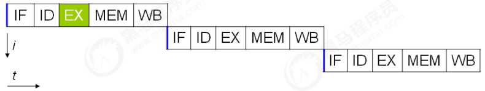

> - instruction fetch (IF) 
>- instruction decode (ID) 
> - execute (EX) 
> - memory access (MEM) 
> - register write back (WB)

在不改变程序结果的前提下，这些指令的各个阶段可以通过**重排序**和**组合**来实现指令级并行，这一技术在 80's 中 叶到 90's 中叶占据了计算架构的重要地位。

> 分阶段，分工是提升效率的关键！
>

指令重排的前提是，重排指令不能影响结果，例如

```java
// 可以重排的例子
int a = 10; // 指令1
int b = 20; // 指令2
System.out.println( a + b );
// 不能重排的例子
int a = 10; // 指令1
int b = a - 5; // 指令2
```

> **参考**： 
>
> [Scoreboarding](https://en.wikipedia.org/wiki/Scoreboarding) and the [Tomasulo algorithm](https://en.wikipedia.org/wiki/Tomasulo_algorithm) (which is similar to scoreboarding but makes use of [register renaming](https://en.wikipedia.org/wiki/Register_renaming) )are two of the most common techniques for implementing out-of-order execution and instruction-level parallelism.

### 3.1.2 支持流水线的处理器

现代 CPU 支持**多级指令流水线**，例如支持同时执行 `取指令 - 指令译码 - 执行指令 - 内存访问 - 数据写回` 的处理 器，就可以称之为**五级指令流水线**。这时 CPU 可以在一个时钟周期内，同时运行五条指令的不同阶段（相当于一 条执行时间最长的复杂指令），IPC = 1，本质上，流水线技术并不能缩短单条指令的执行时间，但它变相地提高了 指令地吞吐率。

> 奔腾四（Pentium 4）支持高达 35 级流水线，但由于功耗太高被废弃
>

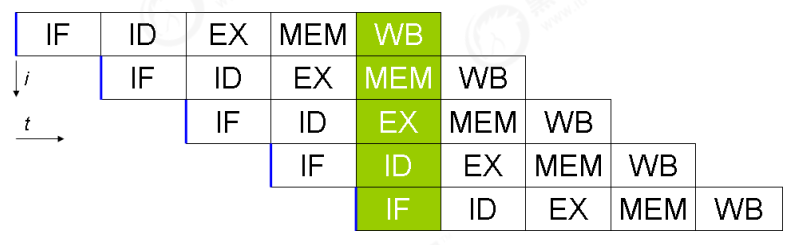


## 3.2 诡异的结果

```java
int num = 0;
boolean ready = false;
// 线程1 执行此方法
public void actor1(I_Result r) {
    if(ready) {
        r.r1 = num + num;
    } else {
        r.r1 = 1;
    }
}
// 线程2 执行此方法
public void actor2(I_Result r) { 
    num = 2;
    ready = true; 
}
```

> I_Result 是一个对象，有一个属性 r1 用来保存结果，问，可能的结果有几种？ 

情况1：线程1 先执行，这时 ready = false，所以进入 else 分支结果为 1 

情况2：线程2 先执行 num = 2，但没来得及执行 ready = true，线程1 执行，还是进入 else 分支，结果为1 

情况3：线程2 执行到 ready = true，线程1 执行，这回进入 if 分支，结果为 4（因为 num 已经执行过了）

还有可能是 0：线程2 执行 ready = true，切换到线程1，进入 if 分支，相加为 0，再切回线程2 执行 num = 2 

这种现象叫做指令重排，是 JIT 编译器在运行时的一些优化，这个现象需要通过大量测试才能复现： 

借助 java 并发压测工具 jcstress https://wiki.openjdk.java.net/display/CodeTools/jcstress

```sh
mvn archetype:generate -DinteractiveMode=false -DarchetypeGroupId=org.openjdk.jcstress -DarchetypeArtifactId=jcstress-java-test-archetype -DarchetypeVersion=0.5 -DgroupId=cn.itcast -DartifactId=ordering -Dversion=1.0 
```

创建 maven 项目，提供如下测试类

```java
@JCStressTest
@Outcome(id = {"1", "4"}, expect = Expect.ACCEPTABLE, desc = "ok")
@Outcome(id = "0", expect = Expect.ACCEPTABLE_INTERESTING, desc = "!!!!")
@State
public class ConcurrencyTest {
    int num = 0;
    boolean ready = false;
    @Actor
    public void actor1(I_Result r) {
        if(ready) {
            r.r1 = num + num;
        } else {
            r.r1 = 1;
        }
    }
    @Actor
    public void actor2(I_Result r) {
        num = 2;
        ready = true;
    }
}
```

执行

```sh
mvn clean install 
java -jar target/jcstress.jar 
```

会输出我们感兴趣的结果，摘录其中一次结果：

```sh
*** INTERESTING tests 
 Some interesting behaviors observed. This is for the plain curiosity. 
 
 2 matching test results. 
 	[OK] test.ConcurrencyTest 
 	(JVM args: [-XX:-TieredCompilation]) 
    Observed state 	Occurrences 	Expectation Interpretation 
    0 				1,729 			ACCEPTABLE_INTERESTING !!!! 
 	1 				42,617,915 		ACCEPTABLE ok 
 	4 				5,146,627 		ACCEPTABLE ok 
 
 	[OK] test.ConcurrencyTest 
 	(JVM args: []) 
 	Observed state 	Occurrences 	Expectation Interpretation 
 	0 				1,652 			ACCEPTABLE_INTERESTING !!!! 
 	1 				46,460,657 		ACCEPTABLE ok 
 	4 				4,571,072 		ACCEPTABLE ok 
```

可以看到，出现结果为 0 的情况有 638 次，虽然次数相对很少，但毕竟是出现了。

### 3.2.2 解决方法

volatile 修饰的变量，可以禁用指令重排

```java
@JCStressTest
@Outcome(id = {"1", "4"}, expect = Expect.ACCEPTABLE, desc = "ok")
@Outcome(id = "0", expect = Expect.ACCEPTABLE_INTERESTING, desc = "!!!!")
@State
public class ConcurrencyTest {
    int num = 0;
    volatile boolean ready = false;
    @Actor
    public void actor1(I_Result r) {
        if(ready) {
            r.r1 = num + num;
        } else {
            r.r1 = 1;
        }
    }
    @Actor
    public void actor2(I_Result r) {
        num = 2;
        ready = true;
    }
}
```

## 3.3 volatile原理

volatile 的底层实现原理是内存屏障，Memory Barrier（Memory Fence） 

- 对 volatile 变量的写指令后会加入写屏障 
- 对 volatile 变量的读指令前会加入读屏障

### 3.3.1 如何保证可见性

写屏障（sfence）保证在该屏障之前的，对共享变量的改动，都同步到主存当中

```java
public void actor2(I_Result r) {
    num = 2;
    ready = true; // ready 是 volatile 赋值带写屏障
    // 写屏障
}
```

而读屏障（lfence）保证在该屏障之后，对共享变量的读取，加载的是主存中最新数据

```java
public void actor1(I_Result r) {
    // 读屏障
    // ready 是 volatile 读取值带读屏障
    if(ready) {
        r.r1 = num + num;
    } else {
        r.r1 = 1;
    }
}
```

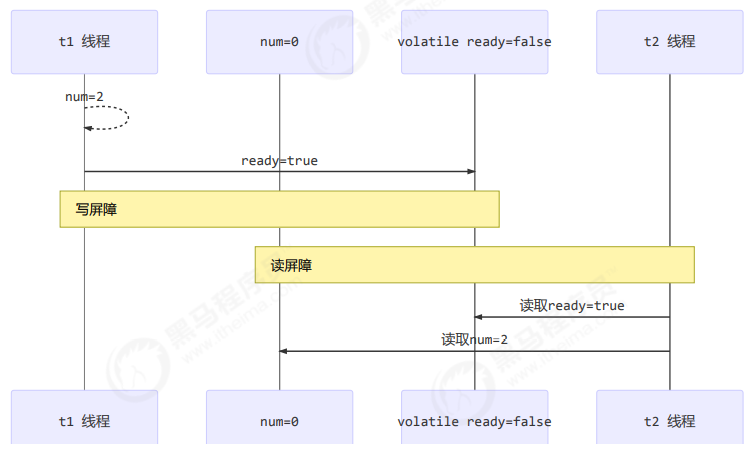

### 3.3.2 如何保证有序性

写屏障会确保指令重排序时，不会将写屏障之前的代码排在写屏障之后

```java
public void actor2(I_Result r) {
    num = 2;
    ready = true; // ready 是 volatile 赋值带写屏障
    // 写屏障
}
```

读屏障会确保指令重排序时，不会将读屏障之后的代码排在读屏障之前

```java
public void actor1(I_Result r) {
    // 读屏障
    // ready 是 volatile 读取值带读屏障
    if(ready) {
        r.r1 = num + num;
    } else {
        r.r1 = 1;
    }
}
```

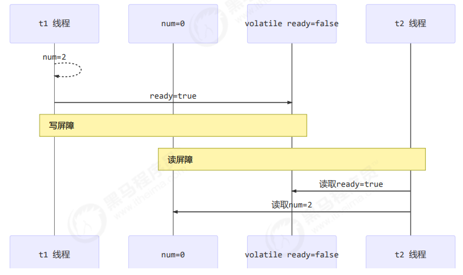

还是那句话，不能解决指令交错： 

- 写屏障仅仅是保证之后的读能够读到最新的结果，但不能保证读跑到它前面去 
- 而有序性的保证也只是保证了本线程内相关代码不被重排序

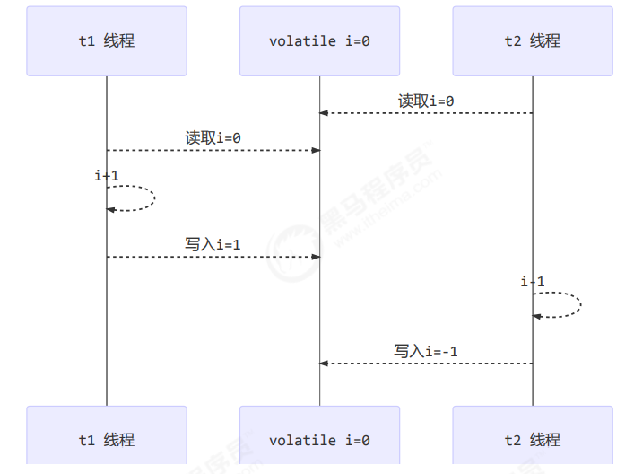

### 3.3.3 double-checked locking 问题

以著名的 double-checked locking 单例模式为例

```java
public final class Singleton {
    private Singleton() { }
    private static Singleton INSTANCE = null;
    public static Singleton getInstance() { 
        if(INSTANCE == null) { // t2
            // 首次访问会同步，而之后的使用没有 synchronized
            synchronized(Singleton.class) {
                if (INSTANCE == null) { // t1
                    INSTANCE = new Singleton();
                } 
            }
        }
        return INSTANCE;
    }
}
```

以上的实现特点是： 

- 首次使用 getInstance() 才使用 synchronized 加锁，后续使用时无需加锁 
- 有隐含的，但很关键的一点：第一个 if 使用了 INSTANCE 变量，是在同步块之外

但在多线程环境下，上面的代码是有问题的，getInstance 方法对应的字节码为：

```sh
0: getstatic #2 // Field INSTANCE:Lcn/itcast/n5/Singleton;
3: ifnonnull 37
6: ldc #3 // class cn/itcast/n5/Singleton
8: dup
9: astore_0
10: monitorenter
11: getstatic #2 // Field INSTANCE:Lcn/itcast/n5/Singleton;
14: ifnonnull 27
17: new #3 // class cn/itcast/n5/Singleton
20: dup
21: invokespecial #4 // Method "<init>":()V
24: putstatic #2 // Field INSTANCE:Lcn/itcast/n5/Singleton;
27: aload_0
28: monitorexit
29: goto 37
32: astore_1
33: aload_0
34: monitorexit
35: aload_1
36: athrow
37: getstatic #2 // Field INSTANCE:Lcn/itcast/n5/Singleton;
40: areturn
```

其中 

- 17 表示创建对象，将对象引用入栈 // new Singleton 
- 20 表示复制一份对象引用 // 引用地址 
- 21 表示利用一个对象引用，调用构造方法 
- 24 表示利用一个对象引用，赋值给 static INSTANCE 

也许 jvm 会优化为：先执行 24，再执行 21。如果两个线程 t1，t2 按如下时间序列执行：

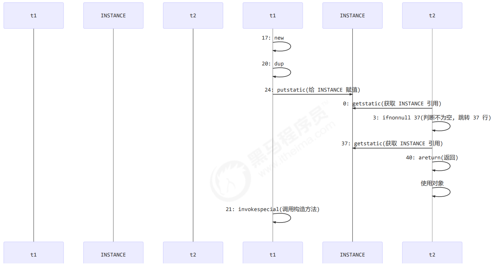

关键在于 0: getstatic 这行代码在 monitor 控制之外，它就像之前举例中不守规则的人，可以越过 monitor 读取 INSTANCE 变量的值 

这时 t1 还未完全将构造方法执行完毕，如果在构造方法中要执行很多初始化操作，那么 t2 拿到的是将是一个未初始化完毕的单例 

对 INSTANCE 使用 volatile 修饰即可，可以禁用指令重排，但要注意在 JDK 5 以上的版本的 volatile 才会真正有效

### 3.3.4 double-checked locking 解决

```java
public final class Singleton {
    private Singleton() { }
    private static volatile Singleton INSTANCE = null;
    public static Singleton getInstance() {
        // 实例没创建，才会进入内部的 synchronized代码块
        if (INSTANCE == null) { 
            synchronized (Singleton.class) { // t2
                // 也许有其它线程已经创建实例，所以再判断一次
                if (INSTANCE == null) { // t1
                    INSTANCE = new Singleton();
                }
            }
        }
        return INSTANCE;
    }
}
```

字节码上看不出来 volatile 指令的效果

```sh
// -------------------------------------> 加入对 INSTANCE 变量的读屏障
0: getstatic #2 // Field INSTANCE:Lcn/itcast/n5/Singleton;
3: ifnonnull 37
6: ldc #3 // class cn/itcast/n5/Singleton
8: dup
9: astore_0
10: monitorenter -----------------------> 保证原子性、可见性
11: getstatic #2 // Field INSTANCE:Lcn/itcast/n5/Singleton;
14: ifnonnull 27
17: new #3 // class cn/itcast/n5/Singleton
20: dup
21: invokespecial #4 // Method "<init>":()V
24: putstatic #2 // Field INSTANCE:Lcn/itcast/n5/Singleton;
// -------------------------------------> 加入对 INSTANCE 变量的写屏障
27: aload_0
28: monitorexit ------------------------> 保证原子性、可见性
29: goto 37
32: astore_1
33: aload_0
34: monitorexit
35: aload_1
36: athrow
37: getstatic #2 // Field INSTANCE:Lcn/itcast/n5/Singleton;
40: areturn
```

如上面的注释内容所示，读写 volatile 变量时会加入内存屏障（Memory Barrier（Memory Fence）），保证下面 两点：

- 可见性 
  - 写屏障（sfence）保证在该屏障之前的 t1 对共享变量的改动，都同步到主存当中 
  - 而读屏障（lfence）保证在该屏障之后 t2 对共享变量的读取，加载的是主存中最新数据 
- 有序性 
  - 写屏障会确保指令重排序时，不会将写屏障之前的代码排在写屏障之后 
  - 读屏障会确保指令重排序时，不会将读屏障之后的代码排在读屏障之前 
- 更底层是读写变量时使用 lock 指令来多核 CPU 之间的可见性与有序性

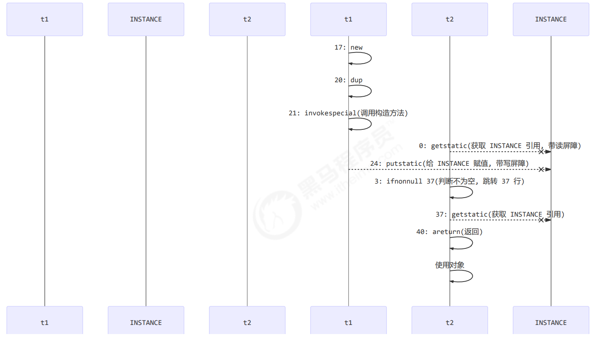

### 3.3.5 happens-before

happens-before 规定了对共享变量的写操作对其它线程的读操作可见，它是可见性与有序性的一套规则总结，抛 开以下 happens-before 规则，JMM 并不能保证一个线程对共享变量的写，对于其它线程对该共享变量的读可见 

- 线程解锁 m 之前对变量的写，对于接下来对 m 加锁的其它线程对该变量的读可见(synchronized关键字的可见性、监视器规则)

  ```java
  static int x;
  static Object m = new Object();
  new Thread(()->{
      synchronized(m) {
          x = 10;
      }
  },"t1").start();
  new Thread(()->{
      synchronized(m) {
          System.out.println(x);
      }
  },"t2").start();
  ```

- 线程对 volatile 变量的写，对接下来其它线程对该变量的读可见(volatile关键字的可见性、volatile规则)

  ```java
  volatile static int x;
  new Thread(()->{
      x = 10;
  },"t1").start();
  new Thread(()->{
      System.out.println(x);
  },"t2").start();
  ```

- 线程 start 前对变量的写，对该线程开始后对该变量的读可见(程序顺序规则+线程启动规则)

  ```java
  static int x;
  x = 10;
  new Thread(()->{
      System.out.println(x);
  },"t2").start();
  ```

- 线程结束前对变量的写，对其它线程得知它结束后的读可见（比如其它线程调用 t1.isAlive() 或 t1.join()等待 它结束）(线程终止规则)

  ```java
  static int x;
  Thread t1 = new Thread(()->{
      x = 10;
  },"t1");
  t1.start();
  t1.join();
  System.out.println(x);
  ```

- 线程 t1 打断 t2（interrupt）前对变量的写，对于其他线程得知 t2 被打断后对变量的读可见（通过 t2.interrupted 或 t2.isInterrupted）（线程中断机制）

  ```java
  static int x;
  public static void main(String[] args) {
      Thread t2 = new Thread(()->{
          while(true) {
              if(Thread.currentThread().isInterrupted()) {
                  System.out.println(x);
                  break;
              }
          }
      },"t2");
      t2.start();
      new Thread(()->{
          sleep(1);
          x = 10;
          t2.interrupt();
      },"t1").start();
      while(!t2.isInterrupted()) {
          Thread.yield();
      }
      System.out.println(x);
  }
  ```

- 对变量默认值（0，false，null）的写，对其它线程对该变量的读可见 

- 具有传递性，如果 `x hb-> y` 并且 `y hb-> z` 那么有 `x hb-> z` ，配合 volatile 的防指令重排，有下面的例子

  ```java
  volatile static int x;
  static int y;
  new Thread(()->{ 
      y = 10;
      x = 20;
  },"t1").start();
  new Thread(()->{
      // x=20 对 t2 可见, 同时 y=10 也对 t2 可见
      System.out.println(x); 
  },"t2").start();
  ```

  > 变量都是指成员变量或静态成员变量 
  >
  > 参考： 第17页
  >
  > 在JMM中有一个很重要的概念对于我们了解JMM有很大的帮助，那就是happens-before规则。happens-before规则非常重要，它是判断数据是否存在竞争、线程是否安全的主要依据。JSR-133S使用happens-before概念阐述了两个操作之间的内存可见性。在JMM中，如果一个操作的结果需要对另一个操作可见，那么这两个操作则存在happens-before关系。
  >
  > 那什么是happens-before呢？在JSR-133中，happens-before关系定义如下：
  >
  > 1. 如果一个操作happens-before另一个操作，那么意味着第一个操作的结果对第二个操作可见，而且第一个操作的执行顺序将排在第二个操作的前面。
  > 2. 两个操作之间存在happens-before关系，并不意味着Java平台的具体实现必须按照happens-before关系指定的顺序来执行。如果重排序之后的结果，与按照happens-before关系来执行的结果一致，那么这种重排序并不非法（也就是说，JMM允许这种重排序）
  >
  > happens-before规则如下：
  >
  > 1. 程序顺序规则：一个线程中的每一个操作，happens-before于该线程中的任意后续操作。
  > 2. 监视器规则：对一个锁的解锁，happens-before于随后对这个锁的加锁。
  > 3. volatile规则：对一个volatile变量的写，happens-before于任意后续对一个volatile变量的读。
  > 4. 传递性：若果A happens-before B，B happens-before C，那么A happens-before C。
  > 5. 线程启动规则：Thread对象的start()方法，happens-before于这个线程的任意后续操作。
  > 6. 线程终止规则：线程中的任意操作，happens-before于该线程的终止监测。我们可以通过Thread.join()方法结束、Thread.isAlive()的返回值等手段检测到线程已经终止执行。
  > 7. 线程中断操作：对线程interrupt()方法的调用，happens-before于被中断线程的代码检测到中断事件的发生，可以通过Thread.interrupted()方法检测到线程是否有中断发生。
  > 8. 对象终结规则：一个对象的初始化完成，happens-before于这个对象的finalize()方法的开始。
  >
  > 参考链接：[happens-before规则解析 - 知乎 (zhihu.com)](https://zhuanlan.zhihu.com/p/77157725)

## 3.4 习题

### 3.4.1 balking 模式习题

希望 doInit() 方法仅被调用一次，下面的实现是否有问题，为什么？

```java
public class TestVolatile {
    volatile boolean initialized = false;
    void init() {
        if (initialized) { 
            return;
        } 
        doInit();
        initialized = true;
    }
    private void doInit() {
    }
} 
```

### 3.4.2 线程安全单例习题

单例模式有很多实现方法，饿汉、懒汉、静态内部类、枚举类，试分析每种实现下获取单例对象（即调用 getInstance）时的线程安全，并思考注释中的问题

**实现1(饿汉式)：**

```java
// 问题1：为什么加 final(防止被子类继承从而重写方法改写单例)
// 问题2：如果实现了序列化接口, 还要做什么来防止反序列化破坏单例(重写readResolve方法)
public final class Singleton implements Serializable {
    // 问题3：为什么设置为私有? 是否能防止反射创建新的实例?(防止外部调用构造方法创建多个实例；不能)
    private Singleton() {}
    // 问题4：这样初始化是否能保证单例对象创建时的线程安全?(能，线程安全性由类加载器保障)
    private static final Singleton INSTANCE = new Singleton();
    // 问题5：为什么提供静态方法而不是直接将 INSTANCE 设置为 public, 说出你知道的理由(可以保证instance的安全性，也能方便实现一些附加逻辑)
    public static Singleton getInstance() {
        return INSTANCE;
    }
    public Object readResolve() {
        return INSTANCE;
    }
}
```

**实现2(枚举类)：**

```java
// 问题1：枚举单例是如何限制实例个数的 (枚举类会按照声明的个数在类加载时实例化对象)
// 问题2：枚举单例在创建时是否有并发问题(没有，由类加载器保障安全性)
// 问题3：枚举单例能否被反射破坏单例(不能)
// 问题4：枚举单例能否被反序列化破坏单例(不能)
// 问题5：枚举单例属于懒汉式还是饿汉式(饿汉)
// 问题6：枚举单例如果希望加入一些单例创建时的初始化逻辑该如何做(写构造方法)
enum Singleton { 
    INSTANCE; 
}
```

**实现3(synchronized方法)：**

```java
public final class Singleton {
    private Singleton() { }
    private static Singleton INSTANCE = null;
    // 分析这里的线程安全, 并说明有什么缺点(没有线程安全问题，同步代码块粒度太大，性能差)
    public static synchronized Singleton getInstance() {
        if( INSTANCE != null ){
            return INSTANCE;
        } 
        INSTANCE = new Singleton();
        return INSTANCE;
    }
}
```

**实现4：DCL+volatile**

```java
public final class Singleton {
    private Singleton() { }
    // 问题1：解释为什么要加 volatile ?(防止putstatic和invokespecial重排导致的异常)
    private static volatile Singleton INSTANCE = null;

    // 问题2：对比实现3, 说出这样做的意义 (缩小了锁的粒度，提高了性能)
    public static Singleton getInstance() {
        if (INSTANCE != null) { 
            return INSTANCE;
        }
        synchronized (Singleton.class) { 
            // 问题3：为什么还要在这里加为空判断, 之前不是判断过了吗(防止首次创建时并发的问题)
            if (INSTANCE != null) { // t2 
                return INSTANCE;
            }
            INSTANCE = new Singleton();//volatile防止指令重排序
            return INSTANCE;
        } 
    }
}
```

**实现5(内部类初始化)：**

```java
public final class Singleton {
    private Singleton() { }
    // 问题1：属于懒汉式还是饿汉式
    private static class LazyHolder {
        static final Singleton INSTANCE = new Singleton();
    }
    // 问题2：在创建时是否有并发问题
    public static Singleton getInstance() {
        return LazyHolder.INSTANCE;
    }
}
```
